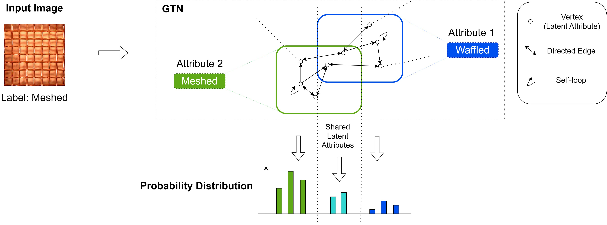
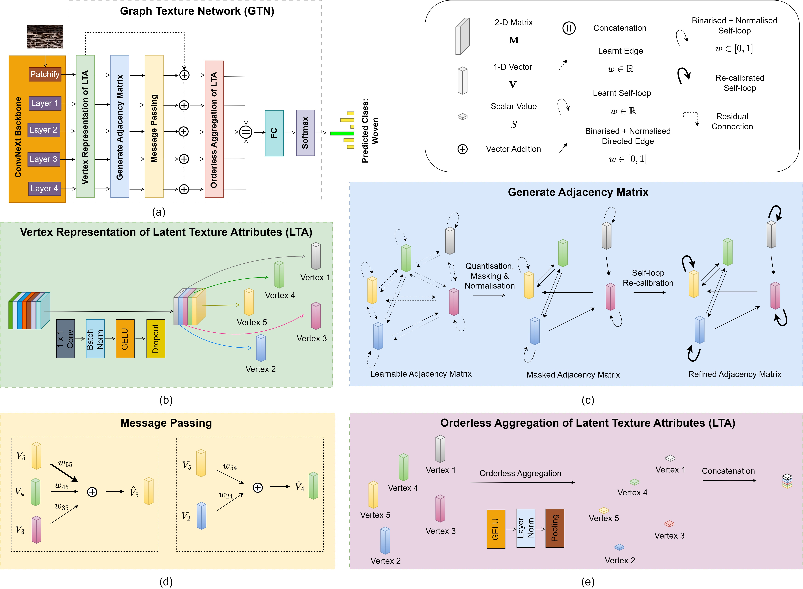

<h1 align="center" style="color: blue;">
    Multiscale Graph Texture Network (GTN)<br>
    The paper will be released soon (it has been accepted at a conference)
</h1>


<div align="center">
  <a href="https://pytorch.org/get-started/locally/"></a>
  <a href="https://pytorch-geometric.readthedocs.io/"></a>
  <a href="https://mlflow.org/"></a>
  <a href="https://hydra.cc/"></a>
</div>
<div align="center">
  
</div>

## :ledger: Table of Contents
- [:bulb: GTN Concept](#bulb-gtn-concept)
- [:classical_building: GTN Architecture](#classical_building-gtn-architecture)
- [:file_folder: Folder Structure](#file_folder-folder-structure)
- [:package: Data Download](#package-data-download)
- [:hammer_and_wrench: Installation](#hammer_and_wrench-installation)
- [:computer: Start MLflow Server](#computer-start-mlflow-server)
- [:gear: Configuration](#gear-configuration)
- [:rocket: Train & Test](#rocket-train--test)
- [:speech_balloon: Contact](#speech_balloon-contact)
- [:pray: Acknowledgement](#pray-acknowledgement)

## :bulb: GTN Concept
Illustration of basic idea of GTN which encodes feature maps associated with a texture image from DTD dataset as a graph, where vertices represent various latent
texture attributes. Information exchange among these related latent texture attributes leads to the formation of a probability distribution over visual texture attributes.



## :classical_building: GTN Architecture

GTN Architecture and associated components. (a) Architecture of GTN applied to ConvNeXt backbone, (b) conversion of feature maps from backbone to graph vertices
representing latent texture attributes, (c) generation of adjacency matrix relating the latent texture attributes, (d) how messages are aggregated and vertices 
are updated, (e) orderless aggregation of latent texture attributes and subsequent concatenation.



## :file_folder: Folder Structure

```plaintext
GTN/
├── conf/
│   └── dataset/
│       ├── common/
│       │   └── architecture.yaml
│       └── dtd.yaml
├── dataloader/
│   ├── __init__.py
│   └── dtd.py
├── src/
│   ├── __init__.py
│   ├── backbone.py
│   ├── build.py
│   ├── loss.py
│   ├── model.py
│   ├── test.py
│   ├── train.py
│   └── utils.py
├── .gitignore
├── main.py
└── README.md
dataset/
└── texture_material/
    └── dtd/
        ├── images/
        │   ├── banded/
        |   |   ├── banded_###.jpg
        |   |   └── ...
        │   ├── blotchy/
        |   |   ├── blotchy_###.jpg
        |   |   └── ...
        |   └── ...
        └── labels/
            ├── train1.txt
            ├── val1.txt
            ├── test1.txt
            └── ...
```

##### Create a `dataset` subfolder inside the `pytorch-material-classification` directory:

```bash
mkdir -p ../pytorch-material-classification/dataset/
```

##### [Optional] Create the following directories in the project root directory to store logs and snapshots:

```bash
mkdir -p ./log ./snapshot
```

## :package: Data Download

Download datasets from the following links: [GTOS](https://1drv.ms/u/s!AmTf4gl42ObncLmEnEv4R5LyxT4?e=ekkFfX), [GTOS_MOBILE](https://1drv.ms/u/s!AmTf4gl42ObnblEtikrw4HfD9fc?e=LjJir4), [DTD](https://www.robots.ox.ac.uk/~vgg/data/dtd/download/dtd-r1.0.1.tar.gz), [KTH-TIPS2-b](https://www.csc.kth.se/cvap/databases/kth-tips/index.html), [FMD](https://people.csail.mit.edu/celiu/CVPR2010/FMD/)

## :hammer_and_wrench: Installation

Ensure you have Python 3.8.16 and the following installed:

```bash
hydra-core==1.3.2
mlflow==2.9.2
torch==1.12.1+cu113 torchvision==0.13.1+cu113 --extra-index-url https://download.pytorch.org/whl/cu113
torch-geometric==2.3.1
timm==0.6.7
numpy==1.24.4
Pillow==10.4.0
```

## :computer: Start MLflow server

Starting the MLflow tracking server remotely. The MLflow tracking server is accessible at the specified IP address (<remote_host>) and port number (<remote_port>). You can create an SSH tunnel to access it locally. 

```bash
mlflow server --host <remote_host> --port <remote_port>
ssh -N -f -L <local_host>:<local_port>:<remote_host>:<remote_port> <username>@<headnode_ip>
```

## :gear: Configuration

To change hyperparameters, backbone selection, or architecture settings, edit the appropriate YAML files located in the conf directory:

```bash
conf/dataset/dtd.yaml
conf/dataset/common/architecture.yaml
```

## :rocket: Train & Test

To run the main Python script. Specify GPU device index and split number:

```bash
python main.py \
       accelerator.device='0' \
       training.split=1
```

## :speech_balloon: Contact
If you have any questions, feel free to reach out at: s220007@e.ntu.edu.sg

## :pray: Acknowledgement
The code for the DataLoaders was sourced from [pytorch-material-classification](https://github.com/jiaxue-ai/pytorch-material-classification).